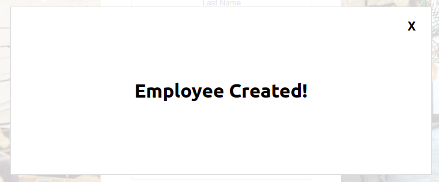

# React Modal

A simple a reusable modal component for React



## Installation

The package can be installed via [npm](https://www.npmjs.com/package/@desireeb/react-modal):
`npm install @desireeb/react-modal`

Or via [yarn](https://yarnpkg.com/package/@desireeb/react-modal):
`yarn add @desireeb/react-modal`

You’ll need to install React, React DOM and PropTypes separately since those dependencies aren’t included in the package. Below is a simple example of how to use the Modal in a React view.

```
import React, { useState } from "react";
import { Modal } from "@desireeb/react-modal";


const Example = () => {

    const [showModal, setShowModal] = useState(false)

    return (
        <Modal show={showModal} handleCloseBtn={() => setShowModal(false)}>
            {content}
        </Modal>
    )
})
```

## Compatibility

React 18.2.0 and newer


